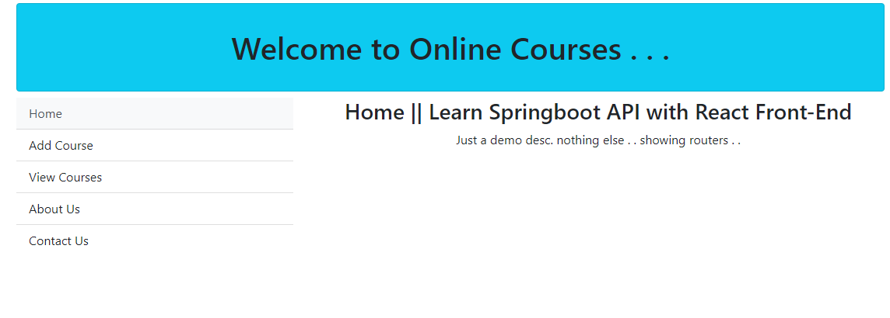
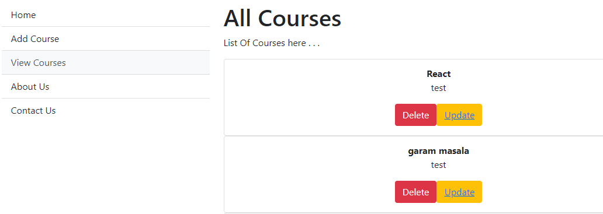
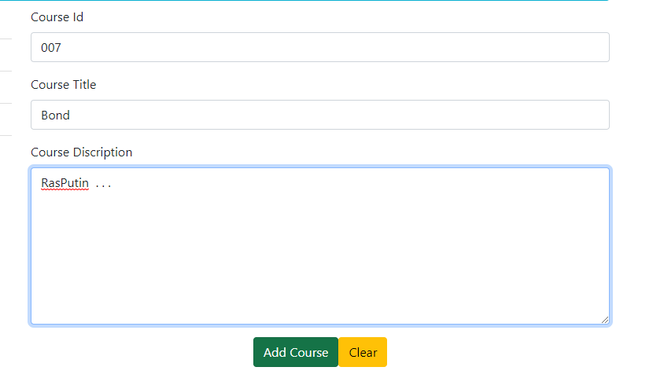
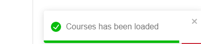

# Courses_spring-react
In this project we have integrated react JS as front-end with spring boot as backend. I have made spring api(for CRUD Operations) courses on port:8080 which we're using it in front end with help of react. I've also used routes in app to make one page web-app. Please refer screenshots for better understanding . . .


After npm-start ---> Visit : http://localhost:3000/

Also, you have to run ApiCourseApplication.java with port :8080/. (You can change if you like.)


Please, refer below screenshots for better understanding.
## Screenshots


#### Home Page


#### All Courses


#### Add Course


#### Toastify Alert 



## Installation

Install project with npm

```bash
  npm install react-scripts
  npm start 
```
    
